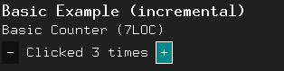
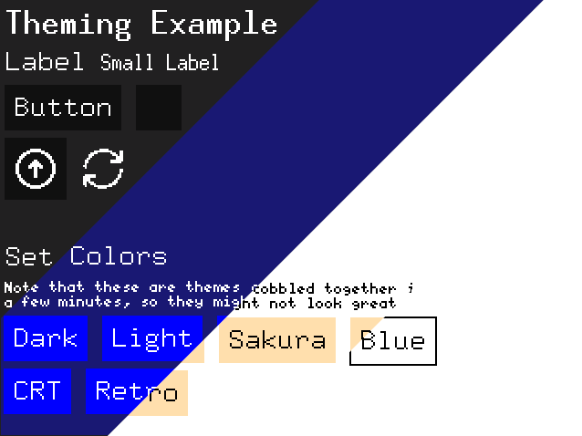

# Kolibri - A GUI framework made to be as lightweight as its namesake

## What is Kolibri?

Kolibri is an embedded Immediate Mode GUI mini-framework very strongly inspired by [egui](https://docs.rs/egui/latest/egui/).
Kolibri is designed to be dead simple.

## Quick Overview

> All examples used in this section can also be found in the `examples` folder.

To get started, add Kolibri to your project using `cargo add kolibri-embedded-gui`, create an `Ui` with a mutable reference to your `embedded-graphics` `DrawTarget`, and you're ready to go!

### Super simple, hyper-effective

Iterate super-quickly, design GUIs like you would write a word document, and run it on literally anything - in minutes.

```rust
fn main() {
  // ... setup code
  
  let mut i = 0;
  
  loop {
    // create the UI each frame
    let mut ui = Ui::new_fullscreen(&mut display, medsize_rgb565_style());
    
    // ... input code
    
    ui.clear_background();
    
    ui.add(Label::new("Basic Example").with_font(ascii::FONT_10X20));

    ui.add(Label::new("Basic Counter (7LOC)"));

    if ui.add_horizontal(Button::new("-")).clicked() {
      i = i.saturating_sub(1);
    }
    ui.add_horizontal(Label::new(format!("Clicked {} times", i).as_ref()));
    if ui.add_horizontal(Button::new("+")).clicked() {
      i = i.saturating_add(1);
    }
    
    // ... simulator code
  }
}
```

Those 11 Lines of code will produce this GUI:



Yes, that's really everything. No boilerplate, no nothing.
If you want to see the full code using the `embedded-graphics-simulator`, look at the `basic-example.rs` file in the `examples` folder.
(note that you need `sdl2` installed to run the simulator)

### Hyper-optimized for performance

#### Incremental Redrawing

Using Kolibri's Smartstate System allows you to only redraw what's actually needed. This enables even super-slow screens
to run at framerates faster than the human eye can see.


So, how much extra code does this need? There's two things you need to do:

1. Initialize a `SmartstateProvider` with the number of smartstates you want to use
2. Add a `smartstate` to each widget you want to be smartstate-reactive

Also, you need to tell the smartstate provider when a widget needs to be forced to redraw.

```rust
fn main() {
  // [...]
  
  // initialize smartstate provider
  let smartstates = SmartstateProvider::<10>::new();
  
  // clear the background only once
  Ui::new_fullscreen(&mut display, medsize_rgb565_style()).clear_background().unwrap();
  
  loop {
    // [...]
    
    // restart the counter at the start (or end) of the loop
    smartstates.restart_counter();

    // add a smartstate to each widget
    ui.add(Label::new("Basic Example").with_font(ascii::FONT_10X20).smartstate(smartstates.nxt()));

    // [...]
    
    if ui.add_horizontal(Button::new("-").smartstate(smartstates.nxt())).clicked() {
      i = i.saturating_sub(1);
      smartstates.nxt().force_redraw()
    }
    ui.add_horizontal(Label::new(format!("Clicked {} times", i).as_ref()).smartstate(smartstates.nxt()));

    // [...]
  }
}
```

Alternatively, use a HashLabel:

```rust
fn main() {
  // [...]
  
  // initialize smartstate provider
  let smartstates = SmartstateProvider::<10>::new();

  // initialize hasher
  let hasher = Hasher::new();
  
  // clear the background only once
  Ui::new_fullscreen(&mut display, medsize_rgb565_style()).clear_background().unwrap();
  
  loop {
    // [...]
    
    // restart the counter at the start (or end) of the loop
    smartstates.restart_counter();

    // add a smartstate to each widget
    ui.add(Label::new("Basic Example").with_font(ascii::FONT_10X20).smartstate(smartstates.nxt()));

    // [...]
    
    // use the button normally - no forced redraws needed!
    if ui.add_horizontal(Button::new("-").smartstate(smartstates.nxt())).clicked() {
      i = i.saturating_sub(1);
    }

    // use a HashLabel instead of a normal Label
    // HashLabels auto-refresh when their content's hash changes
    ui.add_horizontal(HashLabel::new(
      format!("Clicked {} times", i).as_ref(), 
      smartstates.nxt(),
      &hasher
    ));

    // [...]
  }
}

```

For this hassle, you get a speedup of around 15x on an ILI9341 SPI display for the example above,
and over 100x for more complicated GUIs.

> Note:
>
> This will probably be changed to be automatic in the future, which would remove the need for the `smartstate` method,
> but also be a breaking change.

#### Smart Buffering

Using a Full-Frame Buffer is often not possible on embedded devices, due to memory constraints.
Kolibri allows you to use a small buffer, in which each widget is drawn if it is small enough to fit.
This allows you the same speed (or even faster speeds because of incremental redrawing) as a full-frame buffer,
while using only a fraction of the memory.

```rust

// Initialize the buffer somehow
fn main() {
  // [...]
  
  let mut buffer = [Rgb565::CSS_BLACK; 100 * 60 /* guess your maximum widget size approximately */];
  
  // [...]
  
  loop {
    // [...]
    
    // create the UI each frame
    let mut ui = Ui::new_fullscreen(&mut display, medsize_rgb565_style());
    
    // set the buffer
    ui.set_buffer(&mut buffer);
    
    // [...]
  }
  
}
```

Using a buffer *completely* eliminates flickering while redrawing, and
speeds up the drawing considerably (up to 3x faster on an ILI9341 SPI display).

### Theming

Kolibri comes with a built-in theming system, which allows you to easily change the look of your GUI.
Almost all aspects can be customized, from the colors down to the font, icon spacing, size, and more.

This allows you to create themes for any `PixelColor` type (e.g. Black and White for e-ink screens),
and even switch themes at runtime.



> (themes from left to right: Dark, Blue, Light, Retro)

### Compatible with everything

Kolibri is based on the [`embedded-graphics`](https://github.com/embedded-graphics/embedded-graphics/) crate, which
means that it can be used with practically any display driver for Rust.
Kolibri's dead simple input system allows you to use any input device that can give you an `(x, y)` point on your screen,
like touch screen drivers, or mouse pointers.

> Further input device support (e.g. a simulated mouse cursor, or an encoder-based input system) are planned,
> but not yet available. If you need those for a project, feel free to open an issue or a pull request.

## Current State

Kolibri is maturing at a fast pace. Right now, it already has everything you need for a small, basic application.
It's still in alpha, but the API is taking shape. Some breaking changes will happen, but they should be minor,
for the most part at least.

If you're interested in contributing, feel free to open an issue or
a pull request.

You can also generally find me in the [embedded graphics matrix channel](https://matrix.to/#/#rust-embedded-graphics:matrix.org)
if you have any questions.

### Implemented and Planned Features

#### Basic Features

- [x] embedded-graphics based ui rendering
- [x] basic widgets (button, label, checkbox, ...)
- [x] icons
- [x] incremental rendering (only redraw what's actually needed)
- [x] optional buffer-based rendering
- [x] styling

#### Advanced (and granular)

- [ ] layout
  - [x] right-to-left top-to-bottom layout
  - [ ] aligns (center, right, bottom, ...) (partially available in widgets)
  - [x] side panels (right)
  - [ ] side panels (all sides)
  - [x] modals (e.g. drawing an alert box on top of everything else)
    - somewhat done. Still needs too much manual work

- [ ] styling
  - [x] Styling System
  - [x] Premade Styles for RGB565
  - [ ] Premade Styles for other color types
  - [x] Sub-UIs for editing styles on the fly

- [ ] widgets
  - [x] Button
  - [x] Label
  - [x] Checkbox
  - [x] Icon
  - [x] Spacer
  - [x] IconButton
  - [ ] ListBox
  - [ ] Something like a ScrollArea
  - [ ] ProgressBar
  - [x] Toggle
  - [x] Slider
  - [ ] Graph

- [x] performance
  - [x] heap-less if necessary
  - [x] small buffer to draw everything
  - [x] incremental redraws

- [ ] input
  - [x] generic input system (touch)
  - [x] smartstate-reactive basic widgets
  - [ ] virtual mouse cursor (e.g. for joystick-interaction non-touchscreens)
  - [ ] position getter / force-interactor for e.g. encoder input
  - [ ] custom gestures
    - near-impossible without a kind of gesture manager struct.
      Probably better for a separate crate.

- [ ] testing
  - [ ] unit tests for non-widget code
    - [x] framebuffer
    - [ ] smartstates
  - [ ] unit tests for widgets
    - [x] slider
  - [ ] unit tests for drawing components
    - [ ] Placer
    - [ ] Painter
  - [ ] unit tests for layouting (blocked by currently non-existent layouting)
  - [ ] unit tests for Ui struct itself
  - [ ] automated integration tests (maybe Wokwi?)

- [ ] simulator (not yet scheduled, mostly an idea for now)
  - [ ] e-g web simulator based examples
  - [ ] e-g web simulator based playground
    - [ ] select lines to ignore (rationale: paste embedded code, ignore all lines that call to the software,
      and see & develop the GUI in the browser, then copy the code back to the embedded application
      *without deleting lines*)
    - [ ] super-fast live reload

**Something missing?** Add an issue with the features you believe would be good.

### Expected Breaking Changes

- `SmartstateProvider` might be integrated into the GUI,
  which would remove the need for the `smartstate` method on widgets.
- sub_ui methods (e.g. `ui.sub_ui()`, or `ui.right_panel()`) callbacks will change their signature from
  `(&mut UI) -> GuiResult<()>` to `(&mut UI) -> ()` to make Kolibri more ergonomic.
  > Expected API changes:
  >
  > ```rust
  > // current
  > ui.sub_ui(|ui| {
  >   ui.clear_background()?;
  >   ui.add(Label::new("Hello World!"));
  >   Ok(())
  > }).unwrap();
  > // future
  > ui.sub_ui(|ui| {
  >  ui.clear_background().ok();  
  >  ui.add(Label::new("Hello World!"));
  >  });
  > ```

## Why another GUI framework?

Actually, it's in some ways the first, at least in its very, very specific niche.
The `embedded-graphics` environment is awesome, although fairly low-level. The goal of this
library is to make creating simple to somewhat-complex GUIs trivially easy. There is nothing that
does this, really, at least at the time of writing this library.

> #### Sidenote: What is a Kolibri?
>
> Kolibri is the german word for Hummingbird, which is a small bird that is very fast and agile.
> There is also an OS with a similar name (KolibriOS), for similar reasons: It is small and fast.
> This library is in no way associated with the [KolibriOS](https://kolibrios.org/en/) project, but
> I do encourage you to check it out if you're interested.

### What is this not?

Kolibri is not a high-end GUI framework. It is not meant to be used for creating
very complicated or super nice-looking user interfaces. If that's something you're
interested in, check out [the rust bindings for lvgl](https://github.com/lvgl/lv_binding_rust/) or
[slint (not free for commercial use)](https://slint.rs/).

## Changelog

### v0.1.0

- **!BREAKING!** Renaming of `SmartstateProvider::next()` to `SmartstateProvider::nxt()`
- Addition of toggle button / switch
- Addition of Sliders
- Add Subtitles to IconButtons

## License

Licensed under either of

- Apache License, Version 2.0 (LICENSE-APACHE or <http://www.apache.org/licenses/LICENSE-2.0>)
- MIT license (LICENSE-MIT or <http://opensource.org/licenses/MIT>)

at your option.

## Contribution

Unless you explicitly state otherwise, any contribution intentionally submitted for inclusion in the work by you, as
defined in the Apache-2.0 license, shall be dual licensed as above, without any additional terms or conditions.
